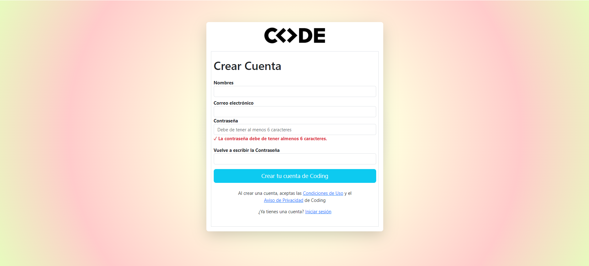

<h1>¡Bienvenido(a) a la Unidad IV - +Chicas Tec!  🚀</h1>

## [By_MiChelleAlanya🦋](https://github.com/bymichelleah)

### ¡Échale un vistazo!
Aqui podras visualizar el contenido de cada sesión realizada en cada semana esta se vera ordenada en una tabla, es decir los temas que abarcaron cada sesion... 🏁  

### ¿Cómo navegar el repositorio?

Cada carpeta contiene los archivos y documentación de las sesiones correspondientes con la codeficación de cada tema.

### ¿Qué tecnologías se estan aplicando?

### Creación de un Formulario Login con Bootstrap - Sesión 60

### 🚀Documentación de la Unidad IV🚀

### 📍Clasificación🔖
| SEMANAS | IDENTIFICADOR | 
| --- | --- |
| SEMANA 12 | 🦋 |
| SEMANA 13 | 🦄 |
| SEMANA 14 | 🐴 |
| SEMANA 15 | 🐼 |
| SEMANA 16 | 🐱 |
| SEMANA 17 | 🐨 |

## Semana 12 💡
| SEMANAS | SESIONES | DESCRIPCIONES |
| --- | --- | --- |
| SEMANA 12 🦋| Sesion 56 | Simple CSS Grid Example ✅|
| SEMANA 12 🦋| Sesion 57 | Bootstrap ✅|
| SEMANA 12 🦋| Sesion 58 | Bootstrap: Componentes ✅|
| SEMANA 12 🦋| Sesion 59 | Sistema Grid, Componentes y Utilidades ✅|
| SEMANA 12 🦋| Sesion 60 | Bootstrap: Componentes - Formulario ✅|

## Semana 13 💡
| SEMANAS | SESIONES | DESCRIPCIONES |
| --- | --- | --- |
| SEMANA 13 🦄 | Sesion 61 | Introducción al Backend y Firebase✅|
| SEMANA 13 🦄 | Sesion 62 | Autenticación con Email✅|
| SEMANA 13 🦄 | Sesion 63 | Autenticación con Email (Segunda parte)✅|
| SEMANA 13 🦄 | Sesion 64 | CRUD con Firebase (lectura y escritura de datos)✅|

## Semana 14 💡
| SEMANAS | SESIONES | DESCRIPCIONES |
| --- | --- | --- |
| SEMANA 14 🐴 | Sesion 66 | Miniproyecto - Diario Digital✅|
| SEMANA 14 🐴 | Sesion 67 | CRUD con Firebase (edición y eliminación)✅|
| SEMANA 14 🐴 | Sesion 67 | CRUD con Firebase (edición y eliminación - segunda parte)✅|
| SEMANA 14 🐴 | Sesion 69 | Colaboración de proyectos en github✅|

## Semana 15 💡
| SEMANAS | SESIONES | DESCRIPCIONES |
| --- | --- | --- |
| SEMANA 15 🐼 | - | Miniproyecto - Diario Digital✅|

## Semana 16 💡
| SEMANAS | SESIONES | DESCRIPCIONES |
| --- | --- | --- |
| SEMANA 16 🐱 | Proyecto final de unidad IV | Avanze de proyecto final✅|
| SEMANA 16 🐱 | Repaso pequeño | Git colaborativo✅|
| SEMANA 16 🐱 | Proyecto final de unidad IV | Avanze de proyecto final✅|
| SEMANA 16 🐱 | Repaso | Repaso de Media Querys✅|

### ¡Muchas gracias por ver🤍!

